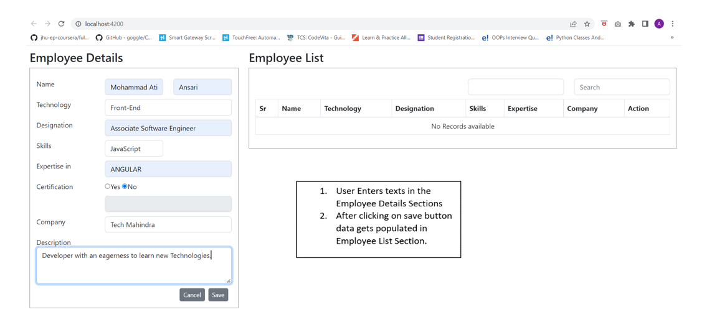
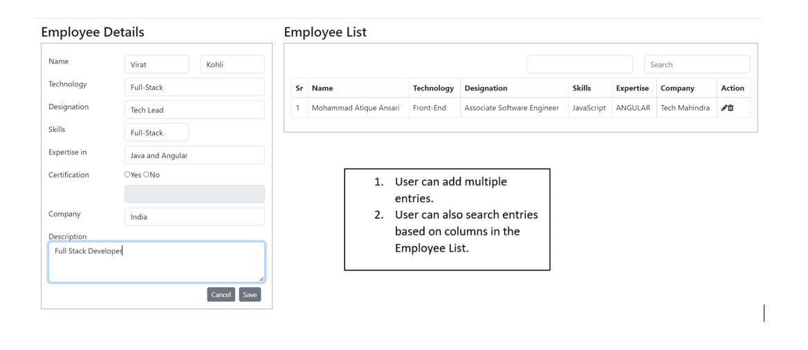
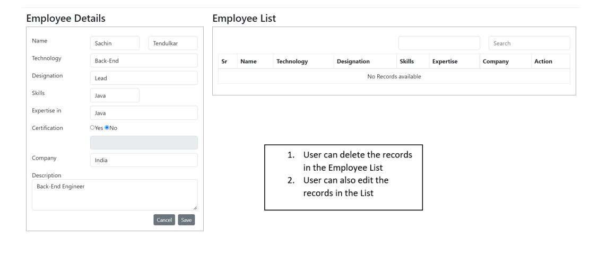

## Angular CRUD Project
- Basic Angular project to achieve CRUD operation.
- The project also uses local Storage to achieve this.
- Topics used include ngfor directive, ngif and template form.
- Below are the images/screenshots of the actual project for reference.

 
<h3 align="center">Features</h3>

## To Build this Project
- Download the Repository
- Open the project in Visual Studio Code
- npm install
- Type 'ng serve' in the terminal. To serve the project
- Run `ng build` to build the project. The build artifacts will be stored in the `dist/` directory.
- To check the working of the project [Click here](https://glistening-tartufo-09cd2d.netlify.app/)
